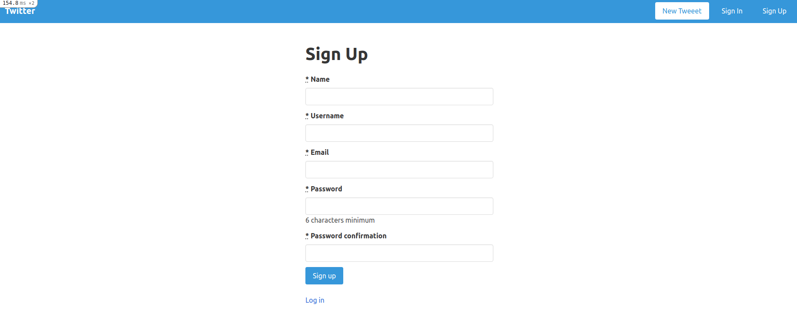
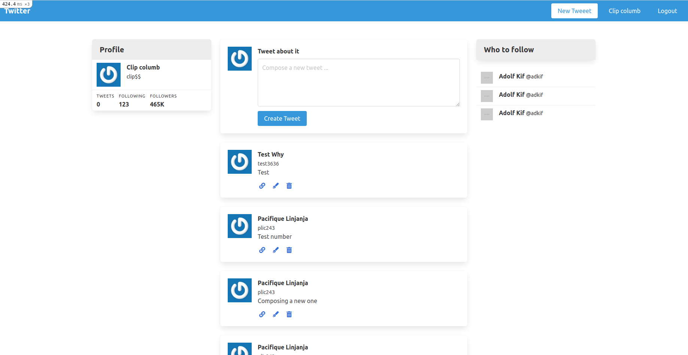
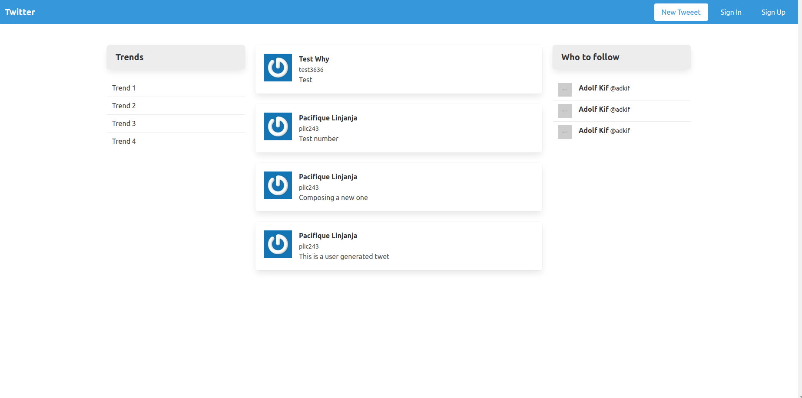

# Twitter clone

This project is about User management logic on web applications using RoR
> This is part of the Forms Project in The Odin Project’s Ruby on Rails Curriculum. Find it at https://www.theodinproject.com/courses/ruby-on-rails/lessons/authentication 

## Built With

- RUBY
- Ruby On Rails
- Visual Code

## GET STARTED

#### Requirements 

- At least one code editor installed (VS Code for example)
- Git installed
- Ruby installed
- At least one web browser
#### Clone the repository

- Click on the "code" button above on this page and copy the link to the repository
- Run 
```
  git clone git@github.com:pacyL2K19/twiter_clone.git
```
- Go to the cloned repository run `cd re-former`

#### Installe required Gem

- In the terminale, run `bundle install`
- [optional] Run `bundle update`

#### Set up the database tables 

Run `rails db:migrate` and make sure the commande succeded

#### Test all in the browser

- Run `$ rails server`
- In the browser go to http://127.0.0.1:3000/
- This page should display ⬇️

#### Main pages








## 🤝 Contributing

Contributions, issues and feature requests are welcome!
## Author

👤 **Pacifique Linjanja**
- Github: [@pacyL2K19](https://github.com/pacyL2K19)
- Twitter: [@PacifiqueLinja1](https://twitter.com/PacifiqueLinja1)
- Linkedin: [Pacifique Linjanja](https://www.linkedin.com/in/pacifique-linjanja/)
